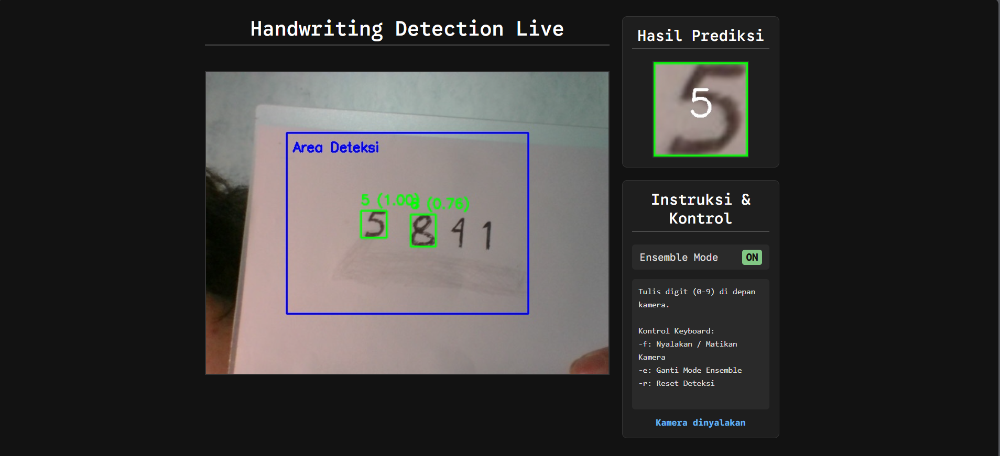

# Deteksi Tulisan Tangan Real-Time dengan OpenCV dan TensorFlow

Ini adalah proyek aplikasi web untuk mendeteksi digit tulisan tangan (0-9) secara real-time menggunakan kamera. Aplikasi ini dibangun dengan Python, OpenCV untuk pemrosesan gambar, TensorFlow/Keras untuk model *machine learning*, dan Flask sebagai *backend* web.

## Tampilan Aplikasi



## Fitur Utama

-   **Deteksi Real-Time**: Mendeteksi digit langsung dari *video stream* kamera.
-   **Antarmuka Web Interaktif**: Tampilan web yang modern dan responsif untuk menampilkan hasil.
-   **Area Deteksi Terpusat**: Fokus pendeteksian hanya pada area 60% x 60% di tengah layar untuk meningkatkan akurasi dan mengurangi gangguan.
-   **Mode Ensemble**: Opsi untuk mengaktifkan/menonaktifkan *ensemble mode* (dengan *test-time augmentation*) untuk prediksi yang lebih kuat.
-   **Kontrol Keyboard**: Interaksi langsung dari browser untuk menyalakan kamera, mengganti mode, dan mereset deteksi.
-   **Visualisasi Jelas**: Menampilkan kotak area deteksi dan *bounding box* hasil prediksi beserta tingkat kepercayaan (*confidence score*).

---

## Teknologi yang Digunakan

-   **Backend**: Python, Flask
-   **Machine Learning**: TensorFlow, Keras
-   **Computer Vision**: OpenCV, NumPy
-   **Frontend**: HTML, CSS, JavaScript (Vanilla)

---

## Instalasi dan Pengaturan

Untuk menjalankan proyek ini di komputer lokal Anda, ikuti langkah-langkah berikut:

1.  **Clone Repositori**
    ```bash
    git clone [URL-repositori-Anda]
    cd [nama-folder-proyek]
    ```

2.  **Buat Virtual Environment**
    Ini akan mengisolasi paket-paket yang dibutuhkan oleh proyek ini.
    ```bash
    python -m venv venv
    ```

3.  **Aktifkan Virtual Environment**
    -   **Windows (PowerShell):**
        ```powershell
        .\venv\Scripts\Activate.ps1
        ```
    -   **Windows (CMD):**
        ```cmd
        venv\Scripts\activate
        ```
    -   **macOS / Linux:**
        ```bash
        source venv/bin/activate
        ```

4.  **Instal Paket yang Dibutuhkan**
    Pastikan Anda sudah membuat file `requirements.txt` (lihat kontennya di bawah).
    ```bash
    pip install -r requirements.txt
    ```

5.  **Siapkan Model**
    Pastikan file model `handwriting_model_augmented.h5` sudah ada di direktori utama proyek.

---

## Menjalankan Aplikasi

1.  Pastikan *virtual environment* Anda sudah aktif (ada tulisan `(venv)` di awal prompt terminal).
2.  Jalankan server Flask:
    ```bash
    python app.py
    ```
3.  Buka browser Anda dan akses alamat berikut:
    ```
    [http://127.0.0.1:5000](http://127.0.0.1:5000)
    ```

---

## Kontrol Aplikasi

Gunakan tombol keyboard berikut saat jendela browser aktif:

-   `f` : Menyalakan / Mematikan Kamera
-   `e` : Mengganti Mode Ensemble (ON/OFF)
-   `r` : Mereset tampilan prediksi terakhir

---

## Struktur Proyek
.
├── app.py                      # Server Flask
├── main.py                     # Class HandwritingDetector
├── handwriting_model_augmented.h5 # Model Keras
├── requirements.txt            # Daftar paket Python
├── README.md                   # File ini
└── templates/
  └── index.html              # Halaman web
